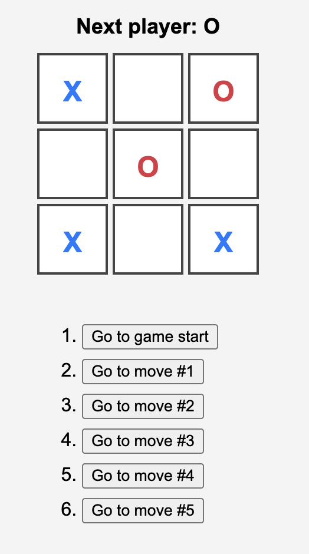
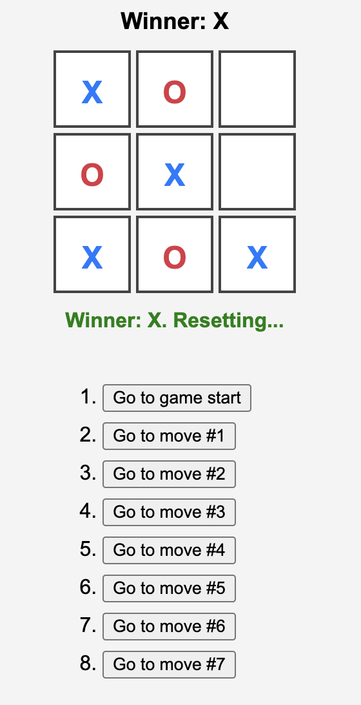

# 🎮 Tic-Tac-Toe with History & Winner Highlight

A modern React implementation of the classic **Tic-Tac-Toe** game with:

✅ Move history (time travel)  
✅ Auto-reset after win  
✅ Highlighting the winning line  
✅ X & O color-coded squares

Built to demonstrate core React concepts like `useState`, `useEffect`, component props, and immutability.

---

## 🚀 Live Demo

👉 [Click to Play Online](https://your-demo-link.com) *(optional)*

---

## 🧠 Features

- ✅ 2-player game (X vs O)
- ⏮️ Move history navigation (time-travel)
- 🔄 Auto-reset after a player wins
- 🌈 Colored X and O squares
- 🟩 Winner's line is highlighted
- 💡 Clean, readable React components

---

## 📸 Screenshots

| Playing             | Winner Highlight       |
|---------------------|------------------------|
|  |  |


---

## 🛠️ Tech Stack

- React (Functional Components)
- JavaScript (ES6+)
- CSS (custom styles)

---

## 📦 Installation

```bash
git c
